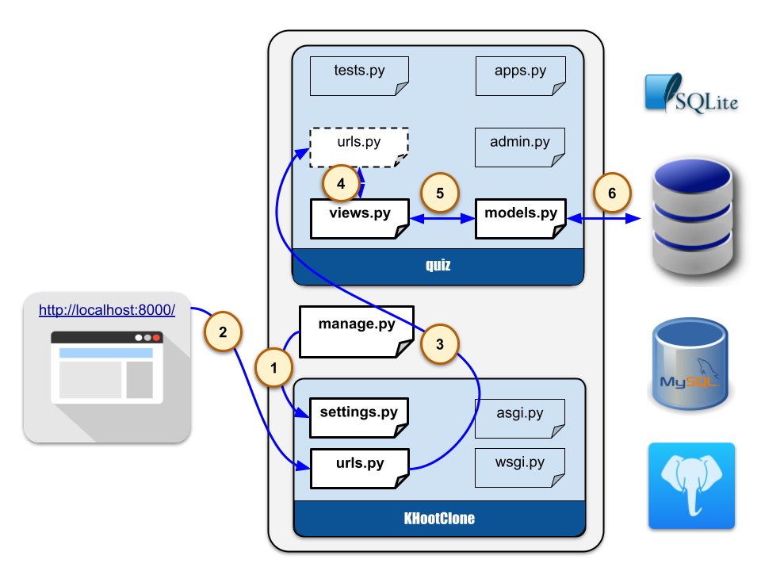

# KhootClone

## สัปดาห์ที่ 3

__การจัดการข้อมูล__
__(model)__

### ผลลัพธ์การเรียนรู้

1. อธิบายรูปแบบการกำหนดรูปแบบการจัดเก็บข้อมูลของ django ได้

2. ประยุกต์ใช้ฟิลด์ (Field) ใน model ได้

3. ประยุกต์ใช้คำสั่งค้นหา (query) ได้ตรงตามเงื่อนไขที่กำหนดให้

### เอกสารประกอบ

* Chapter 3 Models and Databases
     * 3.1 [การติดต่อฐานข้อมูล](https://docs.djangoproject.com/en/5.0/ref/databases/)
     * 3.2 [การเขียน model class](https://docs.djangoproject.com/en/5.0/topics/db/models/)
     * 3.3 [การกำหนดข้อมูลตัวอย่าง (fixtures)](https://docs.djangoproject.com/en/5.0/howto/initial-data/)
     * 3.4 [การส่งคำสัง SQL โดยตรง](https://docs.djangoproject.com/en/5.0/topics/db/sql/)
     * 3.5 [คำสั่งค้นหาข้อมูล](https://docs.djangoproject.com/en/5.0/topics/db/queries/)
     * 3.6 [การรวมผลลัพธ์ (Aggregation)](https://docs.djangoproject.com/en/5.0/topics/db/aggregation/)
     * 3.7 [คำสั่งค้าหา](https://docs.djangoproject.com/en/5.0/topics/db/search/)
* [Tutorial](https://docs.djangoproject.com/en/5.0/intro/tutorial02/)
* [ประเภทของฟิลด์ใน model](https://docs.djangoproject.com/en/5.0/ref/models/fields/#field-types)
* [การค้นหาข้อมูล](https://docs.djangoproject.com/en/5.0/topics/db/queries/)

* [ประเภทของฟิลด์ใน model](https://docs.djangoproject.com/en/5.0/ref/models/fields/#field-types)

* [การค้นหาข้อมูล](https://docs.djangoproject.com/en/5.0/topics/db/queries/)

### เอกสารปฏิบัติ

* [Tutorial](https://docs.djangoproject.com/en/5.0/intro/tutorial02/)

### ภาพประกอบ

